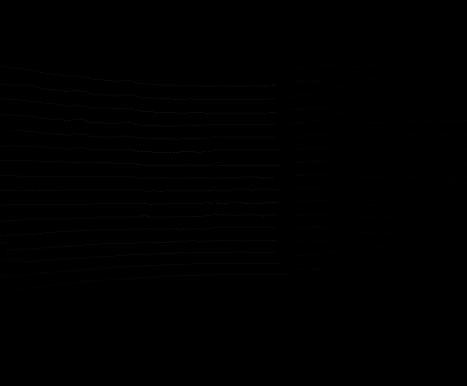

# FuseDepth
Implementation of our paper entitiled [LiDAR-ToF-Binocular depth fusion using gradient priors](https://ieeexplore.ieee.org/abstract/document/9163815) published in CCDC.
## 1. Get Started
### a. Test environment:
```shell script
Ubuntu 16.04
OpenCV 3.4.3
```
### b. Install:
```shell script
mkdir build
cd build
cmake ..
make
```
## 2. Test
To run a demo, do:
```shell script
./Fusion image_folder_name
```
`image_folder_name` the name of an image, or a video frame from a sequence. The folder should include the corresponding RGB image, depth from a 16-wire **lidar**, depth from a **stereo/binocular**, and depth from a **ToF**. The depth data are all saved as 16-bit images. 

A few samples are shown below. They are RGB image, lidar depth, stereo depth, and ToF depth from left to right.
<div align=center>
  &emsp;&emsp;&emsp;&emsp;&emsp;&emsp;
</div>

## 3. Results
The algorithm fuses lidar, stereo, and ToF depth via gradient priors. It takes about **10-20ms** to compute a video frame with a resolution of **640x480**. 
The result is shown below.
<div align=center>
  
</div>
